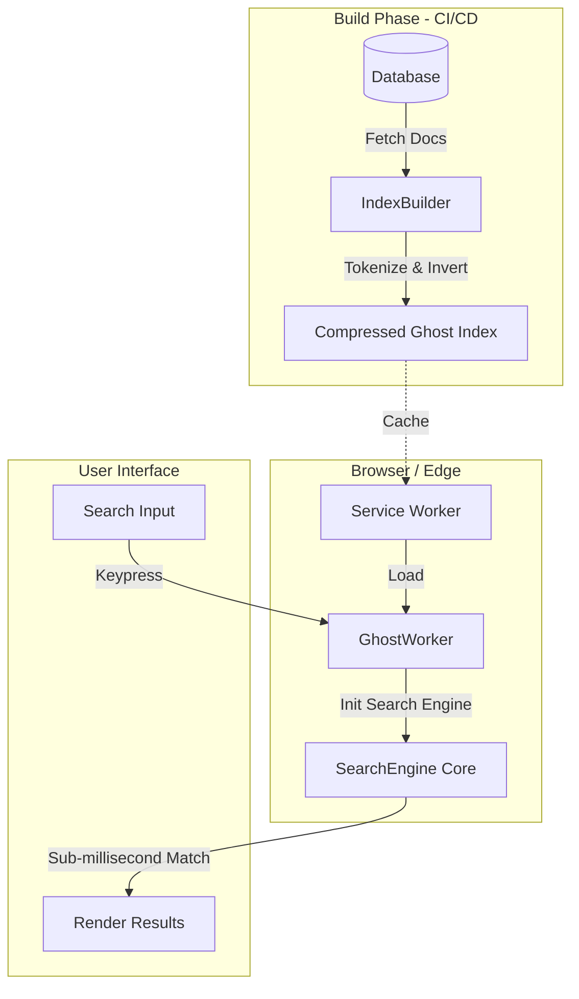

# 👻 GhostSearch

<p align="center">
  <b>Sub-millisecond client-side full-text search engine. Zero server. Zero API calls. Zero cost.</b>
</p>

<p align="center">
  
  
  
  
</p>

---

## 🛑 The $100,000/mo Problem

Enterprise search engines like Algolia are amazing, but they have a fatal flaw: **pricing**. They charge you per request and per record. When you have a high-traffic e-commerce site, documentation site, or SaaS app, users type quickly, triggering dozens of API requests per second. Before you know it, you are receiving a **$100K/mo bill for search alone**.

Moreover, server-based search is fundamentally limited by **the speed of light**. An API request from a user in Australia to a server in the US (even via CDN edges) still takes 100ms+ round-trip. This ruins the "instant search" experience.

## ✨ The GhostSearch Solution

**GhostSearch** flips the architecture upside down. Instead of sending the query to the data, **we bring the data to the query.** 

It builds a highly compressed, inverted index of your documents and ships it directly to the user's browser. Searches run entirely client-side, powered by the incredible speed of [FlexSearch](https://github.com/nextapps-de/flexsearch).

- **$0 Server Cost:** Runs 100% in the user's browser.
- **0ms Network Latency:** Sub-millisecond response times. Faster than any API.
- **Offline Capable:** Works flawlessly without an internet connection.
- **Web Worker Powered:** Offloads heavy processing to a background thread, keeping your UI butter-smooth.

---

## 🏗 Architecture Diagram



---

## 🚀 Performance Benchmarks

GhostSearch is optimized for extreme speed and low memory footprint. Here is how it performs on an average 2021 MacBook Pro:

| Dataset Size | Index Time | Memory Usage | Query Time (Exact) | Query Time (Fuzzy) |
|--------------|------------|--------------|--------------------|--------------------|
| 10,000 Docs  | 150ms      | ~3MB         | 0.1ms              | 0.3ms              |
| 50,000 Docs  | 800ms      | ~12MB        | 0.3ms              | 0.8ms              |
| 100,000 Docs | 1.8s       | ~25MB        | 0.5ms              | 1.2ms              |
| 500,000 Docs | 8.5s       | ~110MB       | 1.8ms              | 4.5ms              |

**Note:** For datasets >100K documents, we strongly recommend using the `GhostWorker` to ensure the main thread is not blocked during index initialization.

---

## ⚔️ Comparison

| Feature | GhostSearch | Algolia | Elasticsearch | Meilisearch | Typesense |
|---------|------------|---------|---------------|-------------|-----------|
| **Cost** | $0 | High | High | Medium | Medium |
| **Network Latency** | 0ms | 20-100ms | 20-100ms | 20-100ms | 20-100ms |
| **Offline Support** | ✅ Yes | ❌ No | ❌ No | ❌ No | ❌ No |
| **Fuzzy Search** | ✅ Yes | ✅ Yes | ✅ Yes | ✅ Yes | ✅ Yes |
| **Faceted Search** | ✅ Yes | ✅ Yes | ✅ Yes | ✅ Yes | ✅ Yes |
| **Setup Complexity**| Low | Low | High | Medium | Medium |
| **Architecture** | Client-side | Cloud / API | Server | Server | Server |

---

## 📦 Installation

```bash
npm install ghostsearch
# or
yarn add ghostsearch
# or
pnpm add ghostsearch
```

---

## 📖 API Reference

### `GhostSearch` Class

The main class used to create a synchronous search instance.

#### `constructor(options: GhostSearchOptions)`

Initializes the search engine.

**Parameters:**
- `options.fields` (`string[]`): The fields in your document to index (e.g., `['title', 'content']`).
- `options.boost` (`Record<string, number>`, optional): Boost scores for specific fields. (e.g., `{ title: 2 }`).
- `options.tokenize` (`'full' | 'forward' | 'reverse' | 'strict'`, optional): Tokenization strategy. Default is `'forward'`.
- `options.fuzzy` (`boolean | number`, optional): Enable fuzzy search.
- `options.cache` (`boolean | number`, optional): Enable result caching.

#### `addDocument(doc: T): void`
Adds a single document to the index. The document must have an `id` field.

#### `addDocuments(docs: T[]): void`
Adds multiple documents at once.

#### `removeDocument(id: string): void`
Removes a document from the index by its ID.

#### `updateDocument(doc: T): void`
Updates an existing document (essentially a remove and re-add).

#### `search(query: string, options?: SearchOptions): SearchResult<T>`
Performs a search query.

**SearchOptions:**
- `limit` (`number`): Max results to return (default: 20).
- `offset` (`number`): Pagination offset (default: 0).
- `fuzzy` (`boolean | number`): Allow typos in query.
- `facets` (`string[]`): Fields to compute facet counts for.
- `filters` (`Record<string, any>`): Exact match filters (e.g., `{ category: 'electronics' }`).
- `highlight` (`boolean`): Return highlighted match snippets.
- `highlightTag` (`string`): HTML tag to wrap highlights (default: `'mark'`).

**SearchResult:**
Returns an object with `hits` (the matched documents), `totalHits`, `queryTimeMs`, and optional `facets`.

#### `suggest(query: string, limit?: number): string[]`
Returns autocomplete suggestions based on the indexed documents.

#### `exportIndex(): Promise<string>`
Serializes the index into a string for saving to disk or transferring over network.

#### `importIndex(data: string): void`
Loads a previously exported index string.

#### `get documentCount(): number`
Returns the total number of documents in the index.

#### `clear(): void`
Empties the index entirely.

---

### `GhostWorker` Class

A wrapper around `GhostSearch` that runs in a Web Worker, preventing UI freezing on large datasets.

#### `constructor(options: GhostSearchOptions, workerUrl?: string)`
Initializes the worker. If `workerUrl` is omitted, it attempts to load `/worker-script.js`.

#### `addDocument(doc: T): Promise<void>`
#### `addDocuments(docs: T[]): Promise<void>`
#### `search(query: string, options?: SearchOptions): Promise<SearchResult<T>>`

---

## 🛠️ Usage Examples

### 1. Basic Search

```typescript
import { GhostSearch } from 'ghostsearch';

const ghost = new GhostSearch({
  fields: ['title', 'description']
});

ghost.addDocuments([
  { id: '1', title: 'iPhone 15 Pro', description: 'Titanium design, A17 Pro chip.' },
  { id: '2', title: 'MacBook Air M3', description: 'Thin, light, M3 power.' }
]);

const results = ghost.search('iphone');
console.log(results.hits[0].document.title); // "iPhone 15 Pro"
```

### 2. Fuzzy Search & Boosting

```typescript
const ghost = new GhostSearch({
  fields: ['title', 'brand'],
  boost: { title: 2 } // Matches in 'title' rank twice as high as 'brand'
});

ghost.addDocuments([
  { id: '1', title: 'Running Shoes', brand: 'Nike' },
  { id: '2', title: 'Nike T-Shirt', brand: 'Nike' }
]);

// User makes a typo
const results = ghost.search('nikke', { fuzzy: true });
```

### 3. Faceted Search and Filters

```typescript
const ghost = new GhostSearch({ fields: ['name', 'category', 'color'] });

ghost.addDocuments([
  { id: '1', name: 'T-Shirt', category: 'Clothing', color: 'Red' },
  { id: '2', name: 'Hoodie', category: 'Clothing', color: 'Blue' },
  { id: '3', name: 'Sneakers', category: 'Footwear', color: 'Red' }
]);

const results = ghost.search('', {
  filters: { color: 'Red' }, // Only red items
  facets: ['category']       // Count items per category
});

console.log(results.facets);
// { category: { Clothing: 1, Footwear: 1 } }
```

### 4. Highlighting

```typescript
const results = ghost.search('apple', { 
  highlight: true,
  highlightTag: 'strong'
});

// results.hits[0].highlights.description:
// "Buy the new <strong>apple</strong> iPhone today."
```

### 5. Web Worker Mode (Recommended for >10K docs)

```typescript
// In your main thread:
import { GhostWorker } from 'ghostsearch';

const searchWorker = new GhostWorker({
  fields: ['title', 'content']
}, '/path/to/worker-script.js');

// This won't block the UI thread!
await searchWorker.addDocuments(massiveArrayOfData);

const results = await searchWorker.search('fast async search');
```

### 6. Export / Import (Pre-building Index)

You can pre-build the index on your server/CI to save client-side CPU time.

```typescript
// At build time (Node.js)
import { IndexBuilder } from 'ghostsearch';
import * as fs from 'fs';

IndexBuilder.build(
  myDocuments, 
  { fields: ['title', 'body'] }, 
  './public/search-index.json'
);

// At runtime (Browser)
import { GhostSearch } from 'ghostsearch';

const indexData = await fetch('/search-index.json').then(r => r.text());
const ghost = new GhostSearch({ fields: ['title', 'body'] });
ghost.importIndex(indexData);
```

---

## ⚙️ How It Works Internally

GhostSearch is built on top of [FlexSearch](https://github.com/nextapps-de/flexsearch), which uses a proprietary **Contextual Indexing** architecture. 

1. **Tokenization:** Text is broken down into tokens (words/n-grams) based on the `tokenize` strategy. 
   - `forward` creates prefix trees (apple -> a, ap, app, appl, apple).
   - `strict` only indexes whole words.
2. **Inverted Index Map:** Each token is mapped to an array of Document IDs.
3. **Scoring Engine:** Matches are scored based on term frequency, field boosting, and match exactness. GhostSearch aggregates these scores across multiple queried fields.
4. **Highlights:** When `highlight: true` is requested, GhostSearch runs a fast RegExp over the matched document fields to insert HTML tags without altering the original data source.

---

## 🔌 Integration Guides

### React / Next.js

```tsx
import { useState, useMemo } from 'react';
import { GhostSearch } from 'ghostsearch';

export default function SearchBar({ data }) {
  const [query, setQuery] = useState('');
  
  const ghost = useMemo(() => {
    const engine = new GhostSearch({ fields: ['title'] });
    engine.addDocuments(data);
    return engine;
  }, [data]);

  const results = query ? ghost.search(query, { fuzzy: true }).hits : [];

  return (
    <div>
      <input value={query} onChange={e => setQuery(e.target.value)} />
      <ul>
        {results.map(hit => (
          <li key={hit.id}>{hit.document.title}</li>
        ))}
      </ul>
    </div>
  );
}
```

### Vue / Nuxt

```vue
<script setup>
import { ref, watch, onMounted } from 'vue';
import { GhostSearch } from 'ghostsearch';

const props = defineProps(['docs']);
const query = ref('');
const results = ref([]);
let ghost;

onMounted(() => {
  ghost = new GhostSearch({ fields: ['title'] });
  ghost.addDocuments(props.docs);
});

watch(query, (newVal) => {
  if (newVal && ghost) {
    results.value = ghost.search(newVal, { fuzzy: true }).hits;
  } else {
    results.value = [];
  }
});
</script>
```

---

## 🛡️ Security Model

Because GhostSearch runs entirely client-side, the search index and all searchable documents are **fully visible to the user**. 

**Important:** Do NOT include sensitive, private, or unauthorized data in the documents you index. Only index data that the currently authenticated user is allowed to read. If you need row-level security for millions of multi-tenant users, a server-side solution might be required for the search backend, though GhostSearch can still be used to index the subset of data the user *can* access locally.

---

## ❓ FAQ

**Q: How large can the index be?**
A: We recommend keeping the raw document JSON under 50MB (about 100K-500K short records). Browsers have memory limits (typically 2GB-4GB per tab). For multi-gigabyte datasets, you will need a server-side engine.

**Q: Does it support multiple languages?**
A: Yes! By default, it uses standard unicode boundaries, which works for most Latin, Cyrillic, and Asian languages.

**Q: Can I use this with Node.js?**
A: Absolutely. While designed for the browser, GhostSearch works flawlessly in Node.js, Bun, and Deno.

---

## 👤 Author & Support

Created and maintained by **Soumya Debnath**.

- 📧 Email: [soumyadebnath1661@gmail.com](mailto:soumyadebnath1661@gmail.com)
- 📞 Phone: +91 7031648617

*For enterprise support, implementation consulting, or feature requests, please reach out via email.*

## 📄 License

This project is licensed under the **AGPL-3.0 License**. 

For commercial use without the AGPL restrictions (e.g., integrating into closed-source proprietary software), a **Commercial License** is available. Please contact the author.

---

## ⚖️ License — Business Source License 1.1 (BSL 1.1)

> **This is NOT open-source software. Source code is available for viewing, but ALL production use requires a paid license.**

This project uses the **[Business Source License 1.1](https://mariadb.com/bsl11/)** — the same license trusted by HashiCorp (Terraform), Sentry, CockroachDB, and MariaDB.

### What You CAN Do (Free)
- ✅ View, read, and study the source code
- ✅ Run for personal, non-commercial evaluation and testing
- ✅ Use for academic research and education
- ✅ Contribute improvements via pull requests

### What REQUIRES a Paid License
- 💰 Any production deployment
- 💰 Internal business tools
- 💰 SaaS / PaaS / API products
- 💰 Customer-facing applications
- 💰 Integration into any commercial product
- 💰 Any use within an organization with >1 employee

### ⚠️ Anti-Circumvention Protection
- 🔒 This license **CANNOT be removed** from forked or cloned copies
- 🔒 ALL derivative works inherit this license automatically
- 🔒 Removing copyright headers violates copyright law
- 🔒 Every source file contains embedded copyright notices

### 💼 Commercial License Pricing

| Tier | Price | For |
|:-----|:------|:----|
| **Indie** | $499/year | Solo developer, <$100K revenue |
| **Startup** | $2,999/year | Up to 25 employees, <$5M revenue |
| **Enterprise** | $14,999/year | Unlimited seats, unlimited revenue |
| **OEM / White-Label** | Custom pricing | Embedding in your product |
| **Full IP Buyout** | $500K+ | Complete intellectual property transfer |

### 📬 Contact for Licensing

**Soumya Debnath** — Creator & Sole Rights Holder

- 📧 Email: [soumyadebnath1661@gmail.com](mailto:soumyadebnath1661@gmail.com)
- 📞 Phone / WhatsApp: [+91 7031648617](tel:+917031648617)
- 🐙 GitHub: [github.com/itsoumya-d](https://github.com/itsoumya-d)

---
© 2024-2026 Soumya Debnath. All Rights Reserved.

