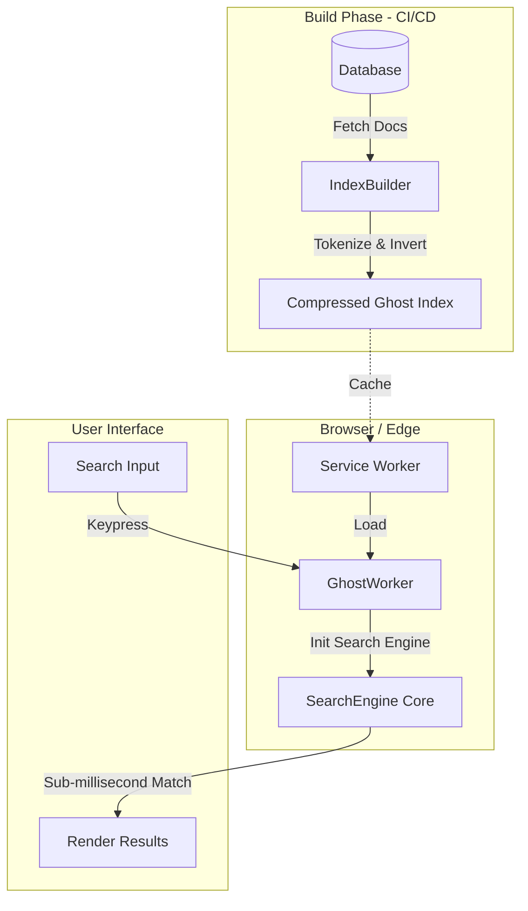

<!--
// Copyright (c) 2024-2026 Soumya Debnath. All Rights Reserved.
// Licensed under the Business Source License 1.1 (BSL 1.1).
// See LICENSE file for details. Production use requires a paid license.
// Contact: soumyadebnath1661@gmail.com | +91 7031648617
-->

# 👻 GhostSearch

<p align="center">
  <b>GhostSearch moves full-text search out of a paid cloud API and into the user's browser, so search costs nothing per query and works offline.</b>
</p>

<p align="center">
  
  
  
  
</p>

> **Project status: pre-release.** GhostSearch is not yet published to npm. It builds, it is
> covered by a 37-test automated suite, and the benchmarks below were generated by a script in
> this repository — but it has no production adopters yet. Install via CDN or from source
> (see [Installation](#-installation)). Please evaluate it as early-stage software.

---

## 🛑 The $100,000/mo Problem

Enterprise search engines like Algolia are amazing, but they have a fatal flaw: **pricing**. They charge you per request and per record. When you have a high-traffic e-commerce site, documentation site, or SaaS app, users type quickly, triggering dozens of API requests per second. Before you know it, you are receiving a **$100K/mo bill for search alone**.

Moreover, server-based search is fundamentally limited by **the speed of light**. An API request from a user in Australia to a server in the US (even via CDN edges) still takes 100ms+ round-trip. This ruins the "instant search" experience.

## ✨ The GhostSearch Solution

**GhostSearch** flips the architecture upside down. Instead of sending the query to the data, **we bring the data to the query.** 

It ships your documents to the user's browser and builds a FlexSearch inverted index there, in
memory. Searches then run entirely client-side, powered by [FlexSearch](https://github.com/nextapps-de/flexsearch).
(`exportIndex()` emits the documents as plain JSON — it is not compressed and is not a serialized
index; see [Export / Import](#6-export--import-pre-building-index).)

- **$0 Server Cost:** Runs 100% in the user's browser.
- **No network round-trip:** queries never leave the browser, so there is no API latency to pay per keystroke. Actual query time depends on corpus size — see [Performance](#-performance).
- **Offline Capable:** Works flawlessly without an internet connection.
- **Web Worker Powered:** Offloads heavy processing to a background thread, keeping your UI butter-smooth.

---

## 🧠 Semantic Vector Search & Hybrid Search (Research-Backed)

GhostSearch features state-of-the-art client-side vector search and hybrid retrieval capabilities, bringing dense vector representations directly to the user's browser.

### 📐 Semantic Vector Search (HNSW + Matryoshka MRL)
- **HNSW graph index**: `VectorIndex.search()` performs a real HNSW greedy-descent traversal.
- **Matryoshka (MRL) funnel**: `searchMatryoshka()` scores every vector at 64d to build a shortlist,
  then re-ranks the shortlist at full dimension.

**Read the following before enabling this.** These are measured properties of the current
implementation, not aspirations:

- `semanticSearch()` defaults to the MRL funnel, and **that path is a brute-force O(n) scan over
  every vector** — it does not traverse the HNSW graph. Pass `matryoshka: false` to use the graph.
- MRL truncation is only sound for embeddings *trained* with an MRL objective. The built-in
  hashing embedder is not, so the funnel loses accuracy rather than saving work: measured
  recall@10 against exhaustive search on 1,000 documents was **0.52 for the MRL funnel versus
  1.00 for `search()`**.
- Index construction is superlinear and slow. Measured `VectorIndex.add()` for 250 / 500 / 1,000 /
  2,000 vectors took 0.58 s / 1.7 s / 4.5 s / 12.5 s (2 vCPU Xeon 2.50GHz) — roughly 2.8x per
  doubling. Treat a few thousand vectors as the practical ceiling.
- The embedder is a feature-hasher, not a trained model — see
  [Known Limitations](#%EF%B8%8F-known-limitations).

### 🔀 Hybrid Search (Keyword + Semantic Fusion)
- **Weighted score fusion**: `score = keywordWeight * normalizedKeywordScore + semanticWeight * cosineSimilarity`
  (defaults 0.4 / 0.6). This is a linear combination, not Reciprocal Rank Fusion — document ranks
  are not used.
- **Caveat on the keyword term**: the keyword score is the sum of matched-field boosts, so when a
  query matches a single field every hit scores 1 and normalizes to 1. In that common case the
  keyword term contributes a constant and the ranking is driven entirely by the vector scores.
- **No external model runtime is wired up.** `EmbeddingEngineOptions.modelUrl` and `tokenizerUrl`
  are accepted but currently ignored; there is no ONNX / Transformers.js integration point yet.

### 🔬 Research Foundation
> **Research Citation:**  
> Kusupati, A., Singh, G., Bhat, W., et al. (2022). *Matryoshka Representation Learning*. Advances in Neural Information Processing Systems (NeurIPS 2022). [arXiv:2205.13147](https://arxiv.org/abs/2205.13147)

### 💻 Hybrid Search Usage Example
```typescript
const search = new GhostSearch({ fields: ['title', 'content'] });
await search.enableSemanticSearch({ dimensions: 384, matryoshkaDims: [64, 256, 384] });
search.addDocuments(docs);
const results = await search.hybridSearch('machine learning optimization');
```

---

## 🏗 Architecture Diagram



---

## 🚀 Performance

These numbers are produced by [`benchmarks/run.mjs`](benchmarks/run.mjs) in this repository.
Regenerate them yourself with `npm run bench`.

**Measured on:** Intel Xeon @ 2.90GHz, 2 vCPU, Node v24.14.1, linux-x64.
**Method:** median and p95 of 500 timed queries after 50 warm-up runs; heap measured with `--expose-gc`.

| Documents | Index time | Heap used | Query p50 (exact) | Query p95 (exact) | Query p50 (fuzzy) |
|-----------|------------|-----------|-------------------|-------------------|-------------------|
| 1,000 | 50 ms | 4.0 MB | 0.026 ms | 0.082 ms | 0.035 ms |
| 10,000 | 590 ms | 34.3 MB | 0.882 ms | 1.587 ms | 0.896 ms |
| 50,000 | 2,403 ms | 170.7 MB | 6.556 ms | 11.954 ms | 6.588 ms |
| 100,000 | 4,786 ms | 342.8 MB | 15.089 ms | 26.728 ms | 16.147 ms |

**How to read this honestly:**

- Sub-millisecond query time holds at **small corpora (~1,000 documents)**. It does not hold at 100k.
- Query time grows roughly linearly with corpus size. At 100k documents expect **~15 ms**, not <1 ms.
- **Memory is the real constraint, not speed.** ~343 MB of heap for 100k documents is a lot to ship to
  a phone. Budget roughly 3.4 MB per 1,000 documents and size your corpus accordingly.
- This was measured on a modest 2-vCPU cloud box. A modern laptop will be faster on the timing
  columns; **heap usage will not change materially**, because it is hardware-independent.
- Index time blocks the main thread. Above ~10k documents, use `GhostWorker` so index construction
  runs off the UI thread.

If you need a corpus in the hundreds of thousands of documents, a server-side engine is very likely
the right tool. GhostSearch is designed for docs sites, product catalogues, help centres, and
in-app search over a bounded dataset.

---

## ⚔️ Comparison

| Feature | GhostSearch | Algolia | Elasticsearch | Meilisearch | Typesense |
|---------|------------|---------|---------------|-------------|-----------|
| **Cost** | $0 | High | High | Medium | Medium |
| **Network Latency** | None (local) | 20-100ms | 20-100ms | 20-100ms | 20-100ms |
| **Offline Support** | ✅ Yes | ❌ No | ❌ No | ❌ No | ❌ No |
| **Fuzzy Search** | ✅ Yes | ✅ Yes | ✅ Yes | ✅ Yes | ✅ Yes |
| **Faceted Search** | ✅ Yes | ✅ Yes | ✅ Yes | ✅ Yes | ✅ Yes |
| **Setup Complexity**| Low | Low | High | Medium | Medium |
| **Architecture** | Client-side | Cloud / API | Server | Server | Server |

---

## 📦 Installation

> **GhostSearch is not published to npm yet.** `npm install ghostsearch` will fail.
> Use one of the two working methods below.

**1. Browser via CDN** — served straight from this repository by jsDelivr.

`dist/index.mjs` is published with FlexSearch left external, so it contains a bare
`import ... from "flexsearch"`. Browsers cannot resolve bare specifiers on their own, so an
**import map is required** — without it the module fails with
`Failed to resolve module specifier "flexsearch"`. The import map must appear before the module
script:

```html
<script type="importmap">
{
  "imports": {
    "flexsearch": "https://cdn.jsdelivr.net/npm/flexsearch@0.7.43/+esm"
  }
}
</script>

<script type="module">
  import { GhostSearch } from 'https://cdn.jsdelivr.net/gh/itsoumya-d/ghostsearch@main/dist/index.mjs';

  const search = new GhostSearch({ fields: ['title', 'content'] });
  search.addDocuments([{ id: '1', title: 'Hello', content: 'world' }]);
  console.log(search.search('hello').hits);
</script>
```

**2. From source** — for bundler/Node projects:

```bash
git clone https://github.com/itsoumya-d/ghostsearch.git
cd ghostsearch
npm install
npm run build      # emits dist/
npm test           # 37 tests
npm run typecheck  # tsc --noEmit
npm run bench      # regenerates the Performance table
```

Bundler users get FlexSearch resolved from `node_modules` automatically, so no import map is needed
there.

Then reference it locally (`npm install /path/to/ghostsearch`) or import from `dist/`.

**Node-only helpers** (`IndexBuilder`, which writes an index to disk at build time) live on a
separate entry point so the browser bundle stays free of Node built-ins:

```js
import { IndexBuilder } from 'ghostsearch/node';
```

---

## 📖 API Reference

### `GhostSearch` Class

The main class used to create a synchronous search instance.

#### `constructor(options: GhostSearchOptions)`

Initializes the search engine. `options` is **required** at runtime despite being typed as optional —
calling `new GhostSearch()` with no argument throws `TypeError: Cannot read properties of undefined
(reading 'fields')`. Note also that the shipped type for this parameter is `any`, so field-name
typos are not caught by the compiler.

**Parameters:**
- `options.fields` (`string[]`): The fields in your document to index (e.g., `['title', 'content']`).
- `options.boost` (`Record<string, number>`, optional): Boost scores for specific fields. (e.g., `{ title: 2 }`).
- `options.tokenize` (`'full' | 'forward' | 'reverse' | 'strict'`, optional): Tokenization strategy. Default is `'forward'`.
- `options.fuzzy` (`boolean | number`, optional): Enable fuzzy search.
- `options.cache` (`boolean | number`, optional): Enable result caching.

#### `addDocument(doc: T): void`
Adds a single document to the index. The document must have an `id` field.

#### `addDocuments(docs: T[]): void`
Adds multiple documents at once.

#### `removeDocument(id: string): void`
Removes a document from the index by its ID.

#### `updateDocument(doc: T): void`
Updates an existing document (essentially a remove and re-add).

#### `search(query: string, options?: SearchOptions): SearchResult<T>`
Performs a search query.

**SearchOptions:**
- `limit` (`number`): Max results to return (default: 20).
- `offset` (`number`): Pagination offset (default: 0).
- `fuzzy` (`boolean | number`): Allow typos in query.
- `facets` (`string[]`): Fields to compute facet counts for.
- `filters` (`Record<string, any>`): Exact match filters (e.g., `{ category: 'electronics' }`).
- `highlight` (`boolean`): Return highlighted match snippets.
- `highlightTag` (`string`): HTML tag to wrap highlights (default: `'mark'`).

**SearchResult:**
Returns an object with `hits` (the matched documents), `totalHits`, `queryTimeMs`, and optional `facets`.

#### `suggest(query: string, limit?: number): string[]`
Returns autocomplete suggestions based on the indexed documents.

#### `exportIndex(): string`
Synchronous. Serializes the **stored documents** to a JSON string for saving to disk or transferring
over the network. Note this is a document dump, not a serialized inverted index — `importIndex()`
rebuilds the index from those documents, so it costs roughly the same CPU as `addDocuments()`.

#### `importIndex(data: string): void`
Loads a previously exported index string.

#### `get documentCount(): number`
Returns the total number of documents in the index.

#### `clear(): void`
Empties the index entirely.

---

### `GhostWorker` Class

A wrapper around `GhostSearch` that runs in a Web Worker, preventing UI freezing on large datasets.

#### `constructor(options: GhostSearchOptions, workerUrl?: string, timeoutMs?: number)`
Initializes the worker. If `workerUrl` is omitted, it attempts to load `/worker-script.js`.
`timeoutMs` (default 30000) bounds how long each call waits for a reply.

**You must supply the worker script yourself.** `dist/worker-script.mjs` also carries a bare
`flexsearch` import, and `dist/worker-script.js` is CommonJS (it calls `require`), so neither file
can be loaded directly by a browser `Worker` as published. Bundle `src/worker-script.ts` (or
`dist/worker-script.mjs`) with FlexSearch inlined and serve that. If the worker fails to load,
pending calls now reject with a descriptive error instead of hanging forever.

#### `dispose(): void`
Terminates the worker and rejects anything still pending.

#### `addDocument(doc: T): Promise<void>`
#### `addDocuments(docs: T[]): Promise<void>`
#### `search(query: string, options?: SearchOptions): Promise<SearchResult<T>>`

---

## 🛠️ Usage Examples

### 1. Basic Search

```typescript
import { GhostSearch } from 'ghostsearch';

const ghost = new GhostSearch({
  fields: ['title', 'description']
});

ghost.addDocuments([
  { id: '1', title: 'iPhone 15 Pro', description: 'Titanium design, A17 Pro chip.' },
  { id: '2', title: 'MacBook Air M3', description: 'Thin, light, M3 power.' }
]);

const results = ghost.search('iphone');
console.log(results.hits[0].document.title); // "iPhone 15 Pro"
```

### 2. Fuzzy Search & Boosting

```typescript
const ghost = new GhostSearch({
  fields: ['title', 'brand'],
  boost: { title: 2 } // Matches in 'title' rank twice as high as 'brand'
});

ghost.addDocuments([
  { id: '1', title: 'Running Shoes', brand: 'Nike' },
  { id: '2', title: 'Nike T-Shirt', brand: 'Nike' }
]);

// User makes a typo
const results = ghost.search('nikke', { fuzzy: true });
```

### 3. Faceted Search and Filters

```typescript
const ghost = new GhostSearch({ fields: ['name', 'category', 'color'] });

ghost.addDocuments([
  { id: '1', name: 'T-Shirt', category: 'Clothing', color: 'Red' },
  { id: '2', name: 'Hoodie', category: 'Clothing', color: 'Blue' },
  { id: '3', name: 'Sneakers', category: 'Footwear', color: 'Red' }
]);

// NOTE: filters and facets are applied to the result set of a query, not to the whole
// corpus. An empty query matches nothing, so it returns zero hits and empty facets.
// Pass a real query term:
const results = ghost.search('shirt', {
  filters: { color: 'Red' }, // narrow the hits to red items
  facets: ['category']       // count hits per category
});

console.log(results.facets);
// { category: { Clothing: 1 } }
// There is currently no "browse with no query" mode.
```

### 4. Highlighting

```typescript
const results = ghost.search('apple', { 
  highlight: true,
  highlightTag: 'strong'
});

// results.hits[0].highlights.description:
// "Buy the new <strong>apple</strong> iPhone today."
```

### 5. Web Worker Mode (Recommended for >10K docs)

```typescript
// In your main thread:
import { GhostWorker } from 'ghostsearch';

const searchWorker = new GhostWorker({
  fields: ['title', 'content']
}, '/path/to/worker-script.js');

// This won't block the UI thread!
await searchWorker.addDocuments(massiveArrayOfData);

const results = await searchWorker.search('fast async search');
```

### 6. Export / Import (Pre-building Index)

You can pre-build the document bundle on your server/CI. Be aware of what this does and does not
buy you: `exportIndex()` emits the documents as JSON, and `importIndex()` re-runs tokenization on
the client. Measured on 20,000 documents, `importIndex()` took 461 ms versus 472 ms for
`addDocuments()` — a ~2.5% saving. The benefit is shipping one static JSON file instead of querying
a database at runtime, not avoiding client-side index construction.

```typescript
// At build time (Node.js) — note the 'ghostsearch/node' subpath: the browser
// entry deliberately does not export IndexBuilder, because it imports node:fs.
import { IndexBuilder } from 'ghostsearch/node';

IndexBuilder.build(
  myDocuments, 
  { fields: ['title', 'body'] }, 
  './public/search-index.json'
);

// At runtime (Browser)
import { GhostSearch } from 'ghostsearch';

const indexData = await fetch('/search-index.json').then(r => r.text());
const ghost = new GhostSearch({ fields: ['title', 'body'] });
ghost.importIndex(indexData);
```

---

## ⚙️ How It Works Internally

GhostSearch is built on top of [FlexSearch](https://github.com/nextapps-de/flexsearch), which uses a proprietary **Contextual Indexing** architecture. 

1. **Tokenization:** Text is broken down into tokens (words/n-grams) based on the `tokenize` strategy. 
   - `forward` creates prefix trees (apple -> a, ap, app, appl, apple).
   - `strict` only indexes whole words.
2. **Inverted Index Map:** Each token is mapped to an array of Document IDs.
3. **Scoring Engine:** the `score` on each hit is the sum of the `boost` values of the fields that
   matched (default boost 1). Term frequency and match position are **not** used, so two documents
   that match in the same single field always tie at the same score and their relative order is
   whatever FlexSearch returned. If you need TF-IDF/BM25-style relevance, you will need to re-rank
   the hits yourself.
4. **Highlights:** When `highlight: true` is requested, GhostSearch runs a fast RegExp over the matched document fields to insert HTML tags without altering the original data source.

---

## 🔌 Integration Guides

### React / Next.js

```tsx
import { useState, useMemo } from 'react';
import { GhostSearch } from 'ghostsearch';

export default function SearchBar({ data }) {
  const [query, setQuery] = useState('');
  
  const ghost = useMemo(() => {
    const engine = new GhostSearch({ fields: ['title'] });
    engine.addDocuments(data);
    return engine;
  }, [data]);

  const results = query ? ghost.search(query, { fuzzy: true }).hits : [];

  return (
    <div>
      <input value={query} onChange={e => setQuery(e.target.value)} />
      <ul>
        {results.map(hit => (
          <li key={hit.id}>{hit.document.title}</li>
        ))}
      </ul>
    </div>
  );
}
```

### Vue / Nuxt

```vue
<script setup>
import { ref, watch, onMounted } from 'vue';
import { GhostSearch } from 'ghostsearch';

const props = defineProps(['docs']);
const query = ref('');
const results = ref([]);
let ghost;

onMounted(() => {
  ghost = new GhostSearch({ fields: ['title'] });
  ghost.addDocuments(props.docs);
});

watch(query, (newVal) => {
  if (newVal && ghost) {
    results.value = ghost.search(newVal, { fuzzy: true }).hits;
  } else {
    results.value = [];
  }
});
</script>
```

---

## 🛡️ Security Model

Because GhostSearch runs entirely client-side, the search index and all searchable documents are **fully visible to the user**. 

**Important:** Do NOT include sensitive, private, or unauthorized data in the documents you index. Only index data that the currently authenticated user is allowed to read. If you need row-level security for millions of multi-tenant users, a server-side solution might be required for the search backend, though GhostSearch can still be used to index the subset of data the user *can* access locally.

---

## ⚠️ Known Limitations

Stated plainly, because you will hit these in evaluation anyway.

**Not published to npm.** The package name is not on the registry yet. Install from source, or
from the CDN using an import map (see [Installation](#-installation)). There is no CI: the
repository has no `.github/` directory, so nothing typechecks, tests or publishes automatically.

**Memory is the binding constraint.** Roughly 3.4 MB of heap per 1,000 documents. A 100k-document
index costs ~343 MB. That is fine on a desktop and hostile on a low-end mobile device. There is no
streaming or partial-index mode yet — the whole index is resident.

**"Sub-millisecond" is corpus-dependent.** True around 1k documents, false at 100k (~15 ms).
See [Performance](#-performance) for the measured curve.

**The whole index ships to the client.** Every user downloads and can read the entire searchable
corpus. Do not put data in a GhostSearch index that the user is not allowed to see. There is no
per-user document-level access control, and there cannot be in a client-side design.

**No incremental index updates over the wire.** Changing one document means rebuilding and
re-shipping the index. This suits content that changes on a deploy cadence, not per-minute data.

**Semantic search uses a built-in hashing embedder, not a trained model.** `enableSemanticSearch()`
runs a deterministic feature-hashing embedder that requires no model download. It is meaningfully
weaker than a transformer embedding model. Treat hybrid search as fuzzy recall improvement, not as
true semantic understanding.

**Node built-ins are not available in the browser entry.** `IndexBuilder` (which uses `node:fs`)
is exported from `ghostsearch/node`, not the main entry. Importing it in browser code will fail.

**Browser support.** Requires ES2020 and ES modules. `GhostWorker` additionally requires Web
Workers. There is no IE11 or legacy-Safari fallback path.

**FlexSearch is an external dependency of the published bundle.** `dist/*` does not inline it, so
browser consumers need an import map and Web Worker consumers need to bundle their own worker
script. See [Installation](#-installation).

**No relevance ranking.** Hit scores are the sum of matched-field boosts; term frequency and match
position are ignored. Documents matching in the same single field all tie, and their order is
arbitrary. If ranking quality matters, re-rank the hits yourself.

**Highlighting returns unescaped document text.** `highlights` values embed the original field text
verbatim with `<mark>` tags inserted. If you render them with `innerHTML`, any HTML in your indexed
documents executes. Escape your documents before indexing, or render highlights through a sanitizer.

**No phrase or proximity queries.** A quoted query such as `"machine learning"` is treated as two
independent terms; word order and adjacency are not considered.

**No production adopters yet.** This is pre-release software with no track record. Benchmarks and
tests are reproducible from this repository; longevity and battle-testing are not yet demonstrated.

---

## ❓ FAQ

**Q: How large can the index be?**
A: We recommend keeping the raw document JSON under 50MB (about 100K-500K short records). Browsers have memory limits (typically 2GB-4GB per tab). For multi-gigabyte datasets, you will need a server-side engine.

**Q: Does it support multiple languages?**
A: Any whitespace-delimited script works — Latin, Cyrillic, Greek, Arabic, Hebrew, Korean are all
fine (verified). Two real caveats:

- **Accents are not folded.** Searching `cafe` does **not** match `café`. Type the accents, or
  normalize both your documents and your queries before indexing.
- **CJK is effectively prefix-only.** Chinese and Japanese have no spaces, so a whole field becomes
  one token. With the default `forward` tokenizer, `机器` matches the document `机器学习优化`
  (a prefix) but `学习` does not (an infix). There is no bundled CJK segmenter. If you need CJK,
  pre-segment your text into space-delimited tokens before indexing.

There is also no stemming: `run` matches `running` (prefix), but `runs` and `optimize` do not match
`running` and `optimization`.

**Q: Can I use this with Node.js?**
A: The main entry (`ghostsearch`) and the Node entry (`ghostsearch/node`) both load and run under
Node — the test suite runs there. `GhostWorker` and `ghostsearch/worker-script` do **not**: they
require the browser `Worker`/`self` globals and throw `ReferenceError: self is not defined` under
plain Node.

---

## 👤 Author & Support

Created and maintained by **Soumya Debnath**.

- 📧 Email: [soumyadebnath1661@gmail.com](mailto:soumyadebnath1661@gmail.com)
- 📞 Phone: +91 7031648617

*For enterprise support, implementation consulting, or feature requests, please reach out via email.*

## 📄 License

This project is licensed under the **Business Source License 1.1 (BSL 1.1)** — see
[LICENSE](LICENSE). It is source-available, **not** OSI open-source: production use of any kind
requires a paid commercial license. The BSL Change Date is 2030-07-26, after which the licence
converts to AGPL-3.0.

For commercial use, see [COMMERCIAL_LICENSE.md](COMMERCIAL_LICENSE.md) or contact the author.

---

## ⚖️ License — Business Source License 1.1

> **Source-available, NOT open-source. All production use requires a paid license.**
> Replaces: Algolia, Elasticsearch

| Tier | Price | For |
|:-----|:------|:----|
| **Indie** | $299/year | Solo developer, <$100K revenue |
| **Startup** | $1,999/year | Up to 10-25 devs, <$5M revenue |
| **Enterprise** | $9,999/year | Unlimited seats, unlimited revenue |
| **OEM / White-Label** | $19,999/year | Embed in your product |
| **Full IP Buyout** | $750,000 | Complete ownership transfer |

**Free use limited to:** Personal evaluation, academic research, contributing via PRs.

📧 [soumyadebnath1661@gmail.com](mailto:soumyadebnath1661@gmail.com) · 📞 [+91 7031648617](tel:+917031648617) · 🐙 [github.com/itsoumya-d](https://github.com/itsoumya-d)

© 2024-2026 Soumya Debnath. All Rights Reserved.
